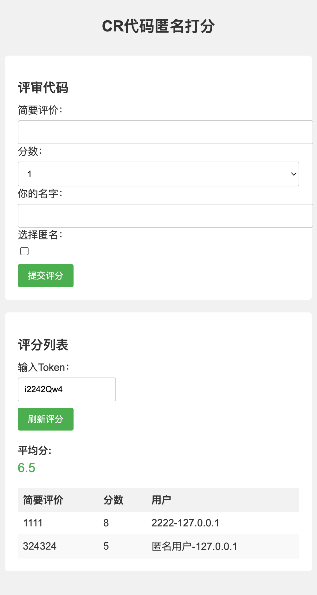

# CR 代码匿名打分

这是一个用于进行代码匿名打分的应用程序。

## 评审代码

用户可以在此部分对代码进行评审和打分。

- 简要评价：请输入简要的评价内容。
- 分数：请选择一个分数，范围从 1 到 10。
- 你的名字：请输入你的名字。
- 选择匿名：勾选此选项以匿名提交评分。

完成填写后，点击"提交评分"按钮，评分将被提交。

## 评分列表

此部分展示了已提交的评分列表。

- 刷新评分按钮：点击此按钮可以刷新评分列表。
- 平均分：显示所有评分的平均值。
- 评分表格：展示了评分的简要评价、分数和提交用户。

## 使用

```bash
bash run.sh
```

## 截图


